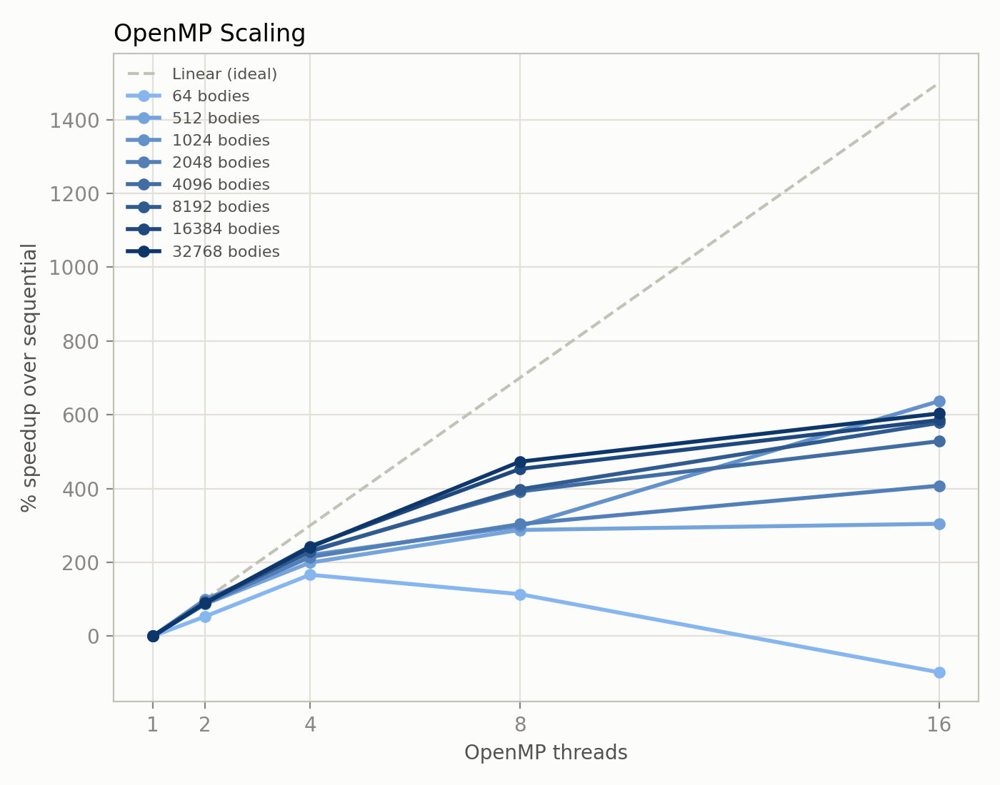
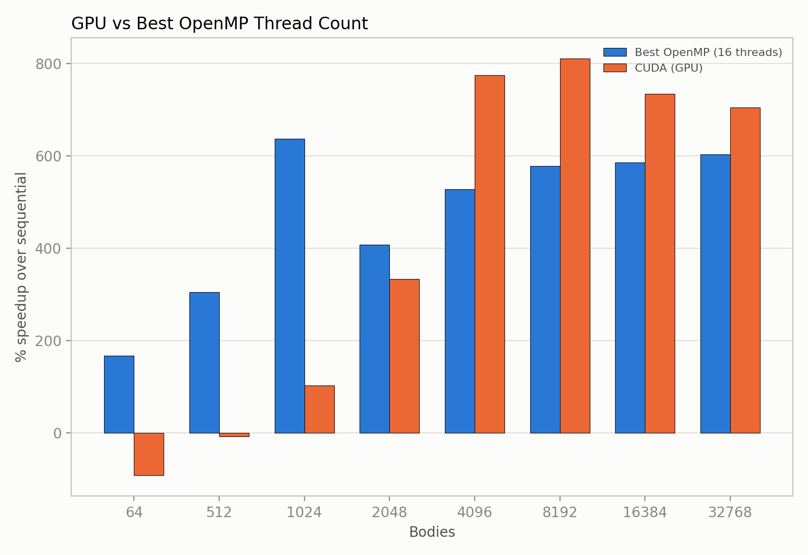

# Gravitational N-Body Simulation

A gravitational N-body simulation implemented sequentially, multi-threaded with OpenMP, and multi-threaded with CUDA, benchmarked against each other across body count and thread count.

## Overview

Bodies start at rest at random positions in a bounded cube, with random masses matching a small (~1km diameter) asteroid. Each step computes the net gravitational pull on every body from every other body, then updates velocities and positions. Bodies bounce off the cube's walls instead of escaping. All units are real SI units (kg, m, s), and the cube is sized to match the real average spacing between asteroids of this size. A padding term keeps the force law from blowing up when two bodies pass very close together, standing in for these being physically-sized bodies rather than points.

## Architecture

- **`include/`, `src/`** - CPU: `Body`/`SimConfig` types, `InitialConditions` (random starting bodies), and `Simulation` (the OpenMP force computation where one thread represents the sequential case).
- **`cuda/`** - GPU: (`Simulation.cu`), the same physics ported to CUDA, using pinned host memory for faster transfers.
- **`Main.cpp`** - runs one simulation and writes a CSV with trajectory information for the animation.
- **`bench/Benchmark.cpp`**, **`cuda/Benchmark.cu`** - sweep body count (and thread count on the CPU side), writing `bench_cpu.csv` / `bench_gpu.csv`.
- **`python/`** - `animate_trajectory.py` renders a trajectory into a GIF (10 bodies for demonstration); `analyze_benchmark.py` turns the benchmark CSVs into scaling charts and a text summary.

## Building

```bash
mkdir -p build && cd build
cmake ..
make
```

Produces `nbody_main`, `nbody_bench_cpu`, and `nbody_bench_gpu` (the third command requires a CUDA compiler such as NVCC).

```bash
python3 -m venv .venv
source .venv/bin/activate
pip install -r requirements.txt
```

## Running

```bash
# from build/
./nbody_main # generates output/trajectory.csv, output/bodies.csv
./nbody_bench_cpu # generates output/bench_cpu.csv
./nbody_bench_gpu # generates output/bench_gpu.csv

# from the project root (with the venv activated)
python3 python/animate_trajectory.py # generates output/nbody_simulation.gif
python3 python/analyze_benchmark.py # generates charts + output/benchmark_summary.txt
```

The benchmark sweeps body counts 64–32768 (incrementing by powers of 2), while the CPU side additionally sweeps 1/2/4/8/16 threads.

## Results





